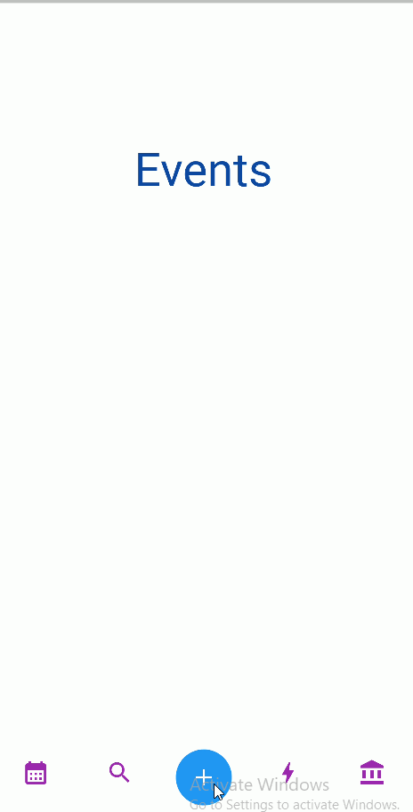

# animation_example

## Images

 
 

## Showcase implementations of:

* [x] Handling State with Value Notifiers
* [x] Implicit Animations
* [x] Explicit Animations
* [x] Staggered Animations
* [x] Drawing and Animating Custom Shape Using Custom Painter
* [ ] Animating List (planned)

## About App
This simple application showcases the use of animations in Flutter to create engaging user interfaces. With this app, you can explore various animation techniques and see how they can bring your Flutter projects to life.

### Contact Me
- LinkedIn: [Abdulaziz Aboujib](https://www.linkedin.com/in/abdul-aziz-aboujib-5a34461b2/)
- Email: Abdulaizizz.94@gmail.com

